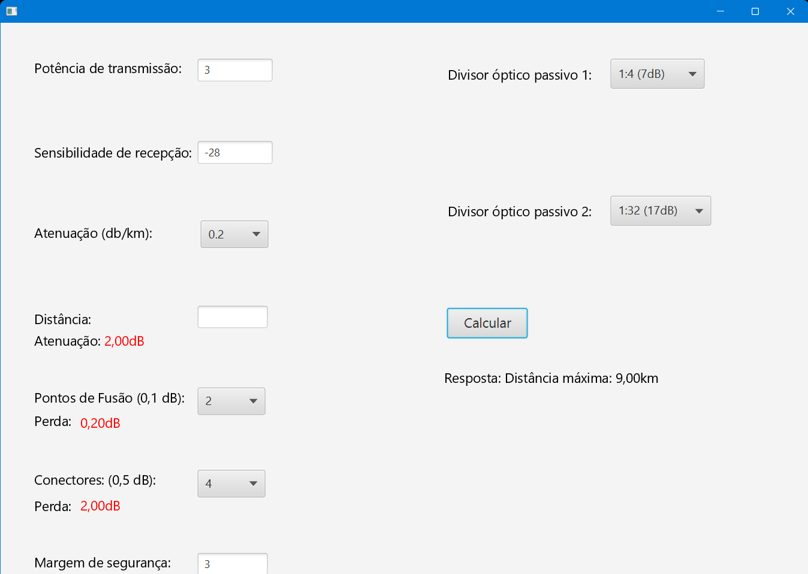

# Calculadora GPON

Este repositório contém um software desenvolvido como projeto acadêmico para a disciplina de **Propagação de Ondas Eletromagnéticas** do curso superior de Engenharia de Computação do **IFSULDEMINAS Campus Poços de Caldas**.

## Sobre o Projeto

A Calculadora GPON é uma aplicação destinada ao cálculo de parâmetros essenciais em projetos de redes GPON (Gigabit Passive Optical Network). Com ela, é possível calcular automaticamente o parâmetro que falta dentre os seguintes:

* **Potência de Transmissão**
* **Sensibilidade de Recepção**
* **Distância Máxima**

Para realizar um cálculo, o usuário precisa fornecer obrigatoriamente:

* Atenuação por quilômetro (dB/km);
* Número de pontos de fusão (escolhendo entre 2 ou 4);
* Número de conectores ópticos (escolhendo entre 4 ou 8);
* Margem de segurança;
* Até dois divisores ópticos passivos (splitters), com opções de divisão entre 1:4 até 1:32.

Além disso, é necessário informar dois dos três parâmetros mencionados acima para que o software calcule automaticamente o terceiro parâmetro faltante.

## Tecnologias Utilizadas

* Linguagem: **Java**
* Interface gráfica: **JavaFX**

## Funcionalidades

* Interface gráfica amigável e intuitiva.
* Cálculo automático e imediato do parâmetro faltante.
* Feedback visual para facilitar a interpretação dos resultados.

## Como Utilizar

### Pré-requisitos

* Java JDK 11 ou superior.
* JavaFX SDK configurado corretamente em seu ambiente.

### Passos para execução

1. Clone este repositório:

```bash
git clone https://github.com/seu-usuario/calculadora-gpon.git
```

2. Abra o projeto na sua IDE de preferência (IntelliJ IDEA, Eclipse, NetBeans, etc.).

3. Configure as bibliotecas do JavaFX caso ainda não estejam configuradas.

4. Execute o arquivo principal `Main.java` para iniciar a aplicação.

## Estrutura do Projeto

```
calculadora-gpon
├── src
│   ├── application
│   │   └── Main.java
│   ├── controller
│   │   ├── CalculadoraController.java
│   │   └── TelaInicialController.java
│   ├── model
│   │   └── Calculadora_GPON.java
│   ├── view
│   │   ├── Calculadora.fxml
│   │   └── TelaInicial.fxml
│   └── module-info.java
└── README.md
```

## Autoria

**Daniel Peçanha Pereira**<br>
**Iago Ananias Silva**<br>
**Filipe Silva**

Engenharia de Computação - IFSULDEMINAS Campus Poços de Caldas
Disciplina: Propagação de Ondas Eletromagnéticas

## Imagens


### Cálculo da Potência


### Cálculo da Sensibildade


### Cálculo da Distância


### Erro na digitação dos valores

